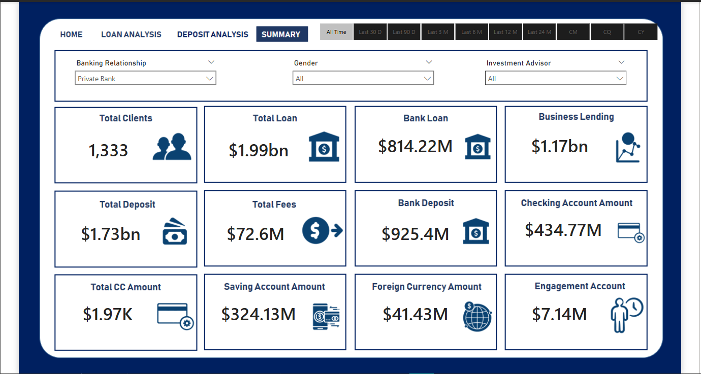
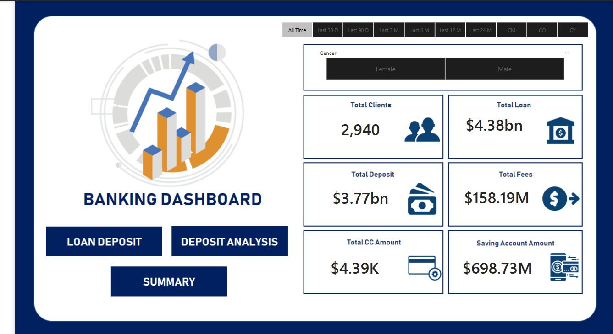

# 🏦 Banking Analytics Dashboard | End-to-End Data Analytics Project (SQL + Python + Power BI)

An interactive and insight-rich banking analytics solution that combines **SQL**, **Python**, and **Power BI** into a full end-to-end data analytics project. From database ingestion to dashboard deployment — this project captures the essence of a real-world business intelligence workflow.

---

## 📌 Project Highlights

🔹 End-to-end solution integrating database management, data cleaning, and dashboarding  
🔹 SQL used for structured storage and relationship modeling  
🔹 Python for data preprocessing, EDA, and validation  
🔹 Power BI for interactive dashboard visualizations with filters and drill-throughs  
🔹 UI wireframes designed to guide user-friendly layout

---

## 🧰 Tools & Technologies

- **SQL** – For importing, managing, and querying datasets  
- **Python** – Used `pandas`for EDA and cleaning  
- **Power BI** – For visualization, DAX, drill-through, and dashboard creation  
- **Wireframing Tool** – For intuitive dashboard layout design

---

## 📈 Dashboard Overview

This dashboard is part of `Banking Dashboard.pbix` and is structured into five pages:

---

### 🏠 1. Home

A clean landing page showing high-level KPIs and key filters:
- Total Clients, Total Deposits, Active Advisors  
- Gender and Relationship filters  
- Navigation to other pages

---

### 📊 2. Summary

A consolidated view of the banking database including:
- Total clients and gender split  
- Client segmentation by investment and loan status  
- Active vs Inactive relationships

---

### 💰 3. Deposit Analysis

Focused on analyzing client deposits:
- Total and average deposits  
- Segment-wise deposit trends  
- Top contributing clients  
- Advisor-wise and gender-wise breakdowns

---

### 🧾 4. Loan Analysis

Insightful breakdown of the loan portfolio:
- Loan type distribution  
- Approved vs Rejected status  
- Advisor performance in loan handling  
- Client borrowing patterns

---

### 🔍 5. Drill Through

Power BI’s drill-through capability for deep-diving:
- Click on any client to view detailed profile  
- Investment, loan, and deposit summaries  
- Advisor-level drill down

---

## ⚙️ Project Workflow

1. **Data Ingestion in SQL**  
   - Loaded all 5 CSVs (clients, relationships, gender, investments, advisors) into a relational database  
   - Performed joins and relational mapping

2. **Analysis with Python**  
   - Cleaned and explored data using `pandas`, `seaborn`, and `matplotlib`  
   - Verified trends and anomalies before visualization

3. **Power BI Dashboarding**  
   - Connected SQL database directly to Power BI  
   - Used DAX for calculated columns and dynamic KPIs  
   - Designed UI based on initial wireframe layout

4. **UI Wireframing**  
   - Created dashboard sketches to visualize structure  
   - Helped maintain consistency and layout flow across pages
